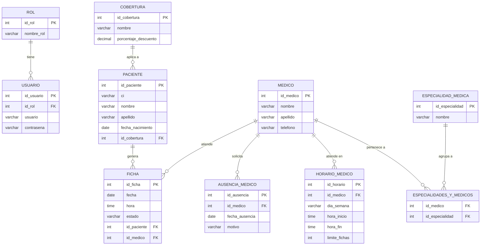
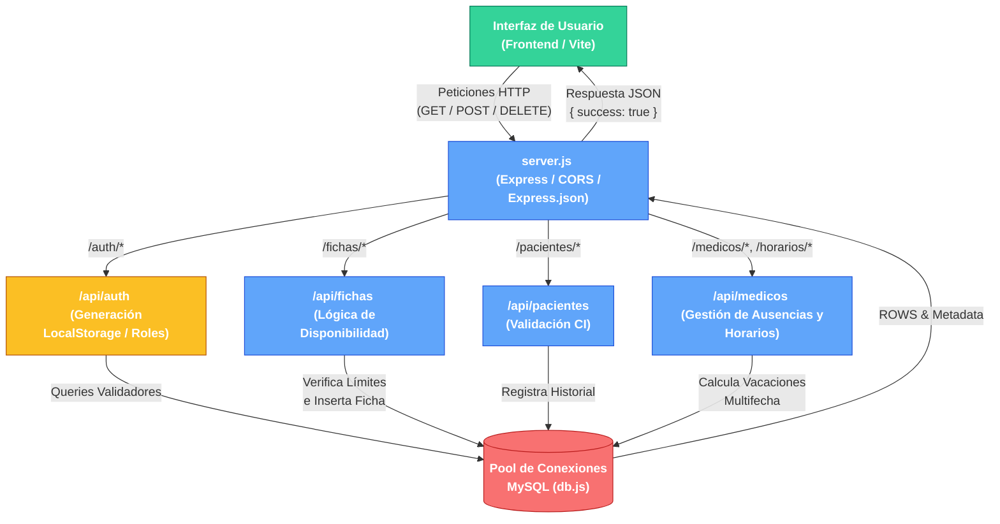

# Diagramas Técnicos del Sistema de Clínica

El sistema puede renderizar automáticamente estos diagramas. Una vez que se muestren visualmente, puedes tomarles una captura o hacer **clic derecho > Guardar imagen como...** (según las opciones de tu pantalla y visor).

## 1. Modelo Entidad-Relación de la Base de Datos

Este diagrama ilustra todas las tablas de tu base de datos y cómo se relacionan a través de sus llaves foráneas.

---

## 2. Diagrama de Lógica y Flujo del Backend

Este diagrama refleja cómo funciona el código en el lado del servidor, mostrando el viaje de los datos desde que el usuario solicita una acción hasta que la base de datos responde.

